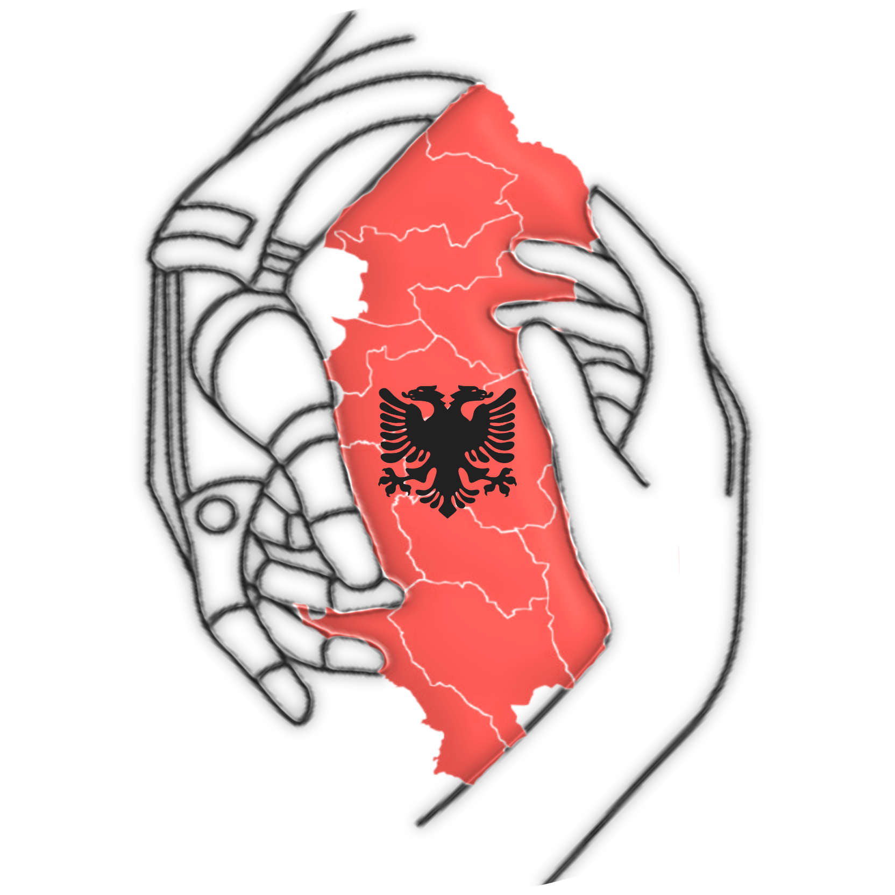

# Shqipëri Fol 
Have you ever had a problem but didn’t know where to report it? Felt like your voice wasn’t being heard?

That’s where <b>Shqipëri Fol</b> comes in.

<b>Shqipëri Fol</b> is a user-friendly, simple, and practical platform designed to connect citizens directly with their municipality. Just type your complaint, and the municipal administration can see it instantly and respond. Not sure how to phrase your concern? Our built-in AI assistant helps you formulate your complaint clearly and effectively.

What makes <b>Shqipëri Fol</b> truly powerful is its community-driven approach. If multiple users share the same issue, they can vote on that complaint. The most supported concerns are prioritized and highlighted on the admin dashboard, ensuring that the issues affecting the most people receive the attention they deserve.

But what about smaller, "easier to solve" problems? We’ve implemented a smart filtering system that identifies straightforward cases and sends them directly to the dashboard—allowing municipalities to resolve quick wins efficiently instead of handling only one major issue per month.

Communication goes both ways. Administrators can update users on the status of their complaints, keeping everyone informed and engaged throughout the process.

And there’s more. <b>Shqipëri Fol</b> also includes a dedicated AI assistant for administrators. This tool helps them understand how to approach specific problems, who to contact and what steps to take for effective resolution.

<b>Shqipëri Fol</b> isn’t just a complaint platform, it’s a smarter, faster, and more transparent way to connect citizens and municipalities.

## Contributors
@4redi
@nensiallushi
@cloudsaa
@joanateneqexhi

## Technologies used

# Thank you! :D
